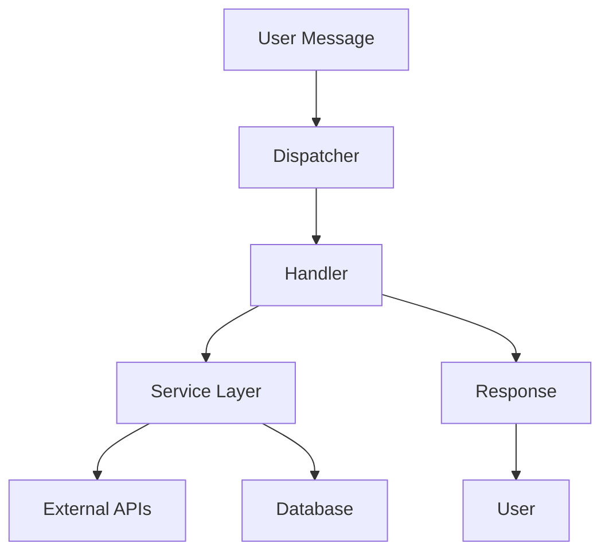

<div align="center">

# 🎓 KLAS Notification Bot

**A smart Telegram bot for Kwangwoon University students**

[](https://python.org)
[](https://telegram.org)
[](https://aiogram.dev)
[](https://sqlalchemy.org)

[](LICENSE)
[](tests/)
[](htmlcov/)

[🚀 Quick Start](#-quick-start) • [📖 Documentation](#-features) • [🛠️ Installation](#️-installation) • [🤝 Contributing](#-contributing)

</div>

---

## 🌟 Features

<table>
<tr>
<td width="50%">

### 📚 **Academic Management**
- 📋 **KLAS Integration** - View assignments, lectures, quizzes
- ⏰ **Smart Notifications** - Never miss a deadline
- 📊 **Student Dashboard** - Track your academic progress
- 🎯 **Todo Management** - Organized task tracking

</td>
<td width="50%">

### 🏫 **Campus Services**
- 🍽️ **Dining Menu** - Daily cafeteria updates
- 📰 **Campus News** - Latest KW announcements
- 📱 **Library QR** - Quick library access codes
- 🤖 **AI Assistant** - Chat about university life

</td>
</tr>
</table>

### 🌍 **Multi-Language Support**
- 🇺🇸 English
- 🇰🇷 Korean (한국어)
- 🇷🇺 Russian (Русский)

---

## 📱 Screenshots

<div align="center">


</div>

---

### Prerequisites

- 🐍 **Python 3.10+**
- 🤖 **Telegram Bot Token** ([Get one from @BotFather](https://t.me/botfather))
- 🔑 **Google Gemini API Key** (Optional, for AI features)

### ⚡ Installation

```bash
# Clone the repository
git clone https://github.com/yourusername/kw_bot.git
cd kw_bot

# Create virtual environment
python -m venv .venv

# Activate virtual environment
# Windows PowerShell
.\.venv\Scripts\Activate.ps1
# macOS/Linux
source .venv/bin/activate

# Install dependencies
pip install -r requirements.txt

# Generate encryption key
python -c "from app.utils.encryption import generate_key; generate_key()"
```

### 🔧 Configuration

Create a `.env` file in the project root:

```env
BOT_TOKEN=your_telegram_bot_token_here
GEMINI_API_KEY=your_google_gemini_api_key_here
ADMIN_ID=your_telegram_user_id
```

### 🚀 Run the Bot

```bash
python main.py
```

---

## 🏗️ Architecture

<details>
<summary><b>📁 Project Structure</b></summary>

```
kw_bot/
├── 📁 app/
│   ├── 📁 database/          # SQLAlchemy models & DB operations
│   ├── 📁 handlers/          # Telegram message handlers
│   ├── 📁 services/          # External API integrations
│   ├── 📁 utils/             # Helper utilities
│   ├── 📁 middleware/        # Anti-spam & other middleware
│   ├── 📄 bot.py            # Bot initialization
│   ├── 📄 config.py         # Settings management
│   ├── 📄 strings.py        # Multi-language strings
│   └── 📄 keyboards.py      # Telegram keyboards
├── 📁 tests/                # Test suite
├── 📁 images/               # Assets & screenshots
├── 📄 main.py              # Application entry point
└── 📄 requirements.txt     # Dependencies
```

</details>

<details>
<summary><b>🔄 Data Flow</b></summary>



</details>

### 🧩 Core Components

| Component | Description |
|-----------|-------------|
| **🤖 Bot Core** | `app/bot.py` - aiogram Bot & Dispatcher setup |
| **🔗 Handlers** | `app/handlers/` - Message routing & processing |
| **⚙️ Services** | `app/services/` - KLAS, Library, News, AI integrations |
| **💾 Database** | `app/database/` - User data & settings storage |
| **🛡️ Security** | `app/utils/encryption.py` - Password encryption |

---

## 🎮 Commands & Usage

### 📋 **Academic Commands**
| Command | Description |
|---------|-------------|
| `/start` | 🏁 Welcome message & quick access menu |
| `/register` | 🔐 Login to KLAS system |
| `/show` | 📚 View assignments & deadlines |
| `/info` | 👤 Student information dashboard |

### 🏫 **Campus Services**
| Command | Description |
|---------|-------------|
| `/menu` | 🍽️ Today's cafeteria menu |
| `/news` | 📰 Latest campus news |
| `/qr` | 📱 Generate library QR code |
| `/lregister` | 📚 Login to library system |

### ⚙️ **Settings**
| Command | Description |
|---------|-------------|
| `/language` | 🌍 Change interface language |
| `/unregister` | 🗑️ Delete stored credentials |
| `/donate` | 💝 Support the developer |

### 🤖 **AI Assistant**
Simply send any text message to chat with the AI about university life!

---

## 🔔 Smart Notifications

The bot automatically monitors your KLAS account and sends notifications for:

- 📅 **Upcoming Deadlines** - Assignments due soon
- 🎯 **New Tasks** - Recently posted assignments
- ⏰ **Lecture Reminders** - Unwatched lectures
- 📊 **Progress Updates** - Academic milestone tracking

---

## 🧪 Testing

```bash
# Run all tests
pytest -v

# Run with coverage
pytest -v --cov=app --cov-report=html

# Run specific test category
pytest tests/unit/ -v
pytest tests/integration/ -v
```

### 📊 Test Coverage
- **Unit Tests** - Database, models, utilities
- **Integration Tests** - Handlers, services
- **E2E Tests** - Full bot workflows

---

## 🚀 Deployment

### 🐧 Linux Service (Systemd)

1. **Copy service file:**
```bash
sudo cp botdaemon.service /etc/systemd/system/kwbot.service
```

2. **Enable and start:**
```bash
sudo systemctl daemon-reload
sudo systemctl enable --now kwbot.service
sudo systemctl status kwbot.service
```

3. **View logs:**
```bash
sudo journalctl -u kwbot.service -f
```

### 🐳 Docker (Coming Soon)
Docker support is planned for easier deployment.

---

## 🛠️ Development

### 🔧 Setup Development Environment

```bash
# Install development dependencies
pip install -r requirements-dev.txt

# Run pre-commit hooks
pre-commit install

# Format code
black app/
isort app/

# Type checking
mypy app/
```

### 📝 Contributing Guidelines

1. **Fork** the repository
2. **Create** a feature branch (`git checkout -b feature/amazing-feature`)
3. **Commit** your changes (`git commit -m 'Add amazing feature'`)
4. **Push** to the branch (`git push origin feature/amazing-feature`)
5. **Open** a Pull Request

---

## 🔒 Security & Privacy

- 🔐 **Encrypted Storage** - User passwords encrypted with Fernet
- 🛡️ **Anti-Spam** - Built-in rate limiting
- 🔑 **Secure Keys** - Environment-based configuration
- 🚫 **No Data Sharing** - Your data stays private

### ⚠️ Security Best Practices

- Never commit `.env` or `encryption_key.key`
- Rotate API keys regularly
- Use strong, unique passwords
- Keep dependencies updated

---

## 🆘 Troubleshooting

<details>
<summary><b>🔧 Common Issues</b></summary>

### Bot Won't Start
- ✅ Check `BOT_TOKEN` in `.env`
- ✅ Verify `encryption_key.key` exists
- ✅ Ensure Python 3.10+ is installed

### KLAS Login Fails
- ✅ Verify KW credentials
- ✅ Check network connectivity
- ✅ Try re-registering with `/register`

### Missing Dependencies
```bash
pip install --upgrade -r requirements.txt
```

### Permission Errors (Linux)
```bash
sudo chown -R $USER:$USER /path/to/bot
chmod +x main.py
```

</details>

---

## 📄 License

This project is licensed under the **MIT License** - see the [LICENSE](LICENSE) file for details.

---

## 🤝 Contributing

Contributions are what make the open source community amazing! Any contributions you make are **greatly appreciated**.

<div align="center">

### 💝 Support the Project

If this bot helps you manage your university life better, consider:

[](https://buymeacoffee.com/yourusername)
[](https://ko-fi.com/yourusername)

**⭐ Star this repository if you found it helpful!**

</div>

---

<div align="center">

**Made with ❤️ for Kwangwoon University students**

[🔝 Back to Top](#-klas-notification-bot)

</div>
