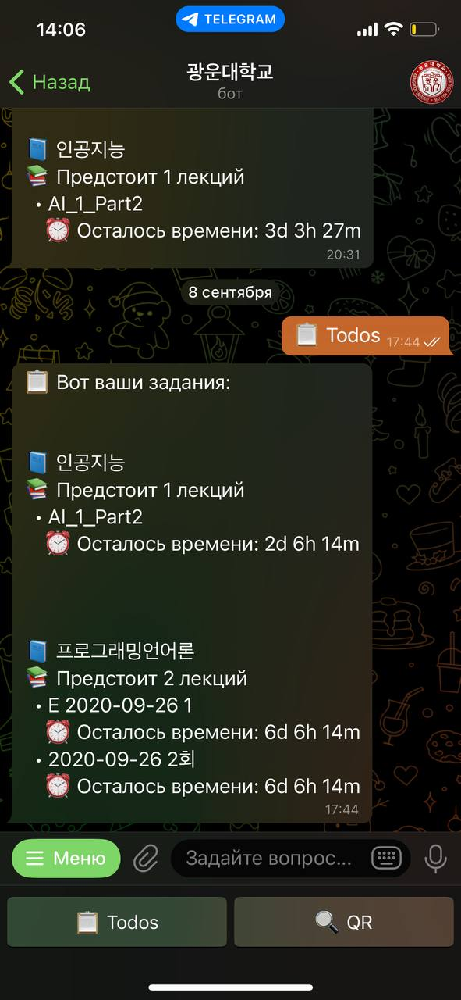
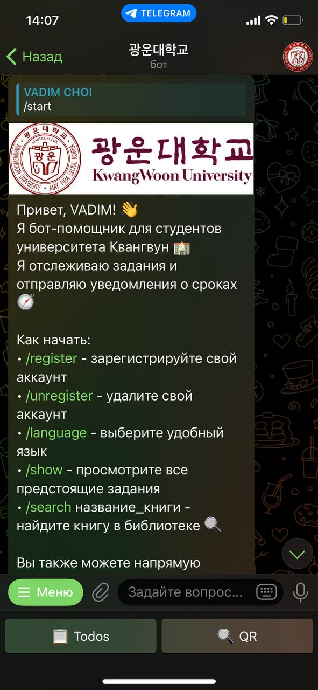
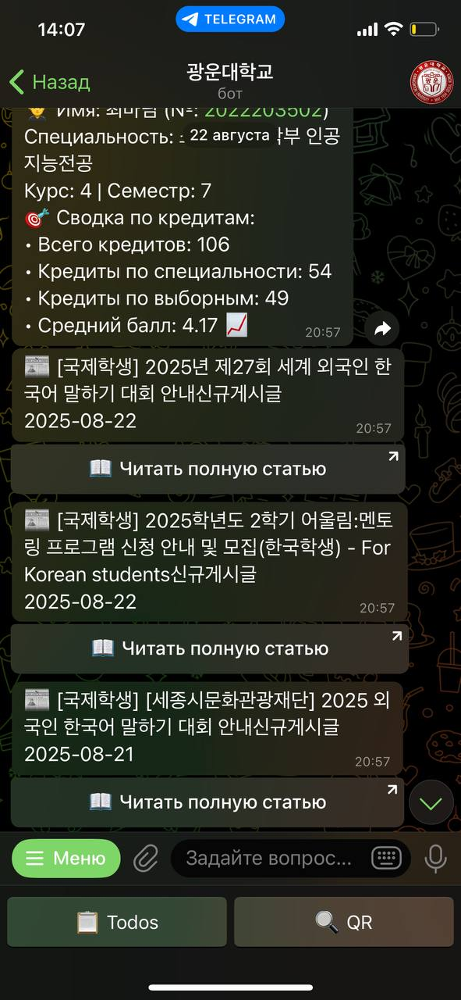

# KLAS Notification Bot

A Telegram bot for Kwangwoon University (KW) students that helps you:

- Show KLAS assignments, lectures, quizzes, and team projects with time left
- Get KW cafeteria menu and campus news
- Generate KW Library QR codes
- View student information and progress
- Receive periodic notifications about upcoming deadlines
- Chat Q&A about university life via LLM integration (Google Gemini)
- 3 languages (English, Korean, Russian)

This repository contains an async Python bot built with `aiogram`, `aiohttp`, and `SQLAlchemy`, with a modular architecture and test suite using `pytest`.

## Table of Contents

- Overview
- Features
- Architecture
- Getting Started
- Configuration (.env)
- Running the Bot
- Commands & Interactions
- Notifications
- Tests
- Deployment (Linux service)
- Troubleshooting
- Security Notes

## Overview

- Entry point: `main.py`
- Bot setup: `app/bot.py`
- Handlers: `app/handlers/`
- Services (external APIs, scraping, integrations): `app/services/`
- Database models and async access: `app/database/`
- Utilities (encryption, language utilities, typing indicator, chat history): `app/utils/`
- Strings and multilingual support: `app/strings.py`
- Images and assets: `images/`
- Tests: `tests/`

The project uses environment variables via `python-dotenv` and Pydantic `BaseSettings` (`app/config.py`).

## Features

- KLAS integration via `app/services/kw.py`
  - Login with encrypted credentials
  - Fetch subjects, assignments, lectures, quizzes
  - Aggregate TODO list across subjects
  - Student info and photo fetch
- Library QR integration via `app/services/qr.py`
- KW news scraper via `app/services/news.py`
- Dining menu via `app/services/food.py`
- Notifications service via `app/services/notifications.py`
- Anti-spam middleware via `app/middleware/antispam.py`
- LLM chat responses via `app/services/llm.py` (Google Gemini)
- Multilingual strings via `app/strings.py` and language helpers in `app/utils/`

## Screenshots

<p align="center">
  
  
  
</p>

## Architecture

- `app/bot.py`
  - Creates `Bot` and `Dispatcher` (aiogram)
  - Registers middleware (`AntiSpamMiddleware`)
  - Registers all handlers via `setup_handlers()`
- `main.py`
  - Sends startup/shutdown notifications to admin
  - Initializes DB, menu commands (`app/menu.py`), and handlers
  - Runs polling and the notification service concurrently
- Handlers in `app/handlers/`
  - `common.py`: `/start`, `/language`, donation/refund, “other messages” routing + LLM Q&A
  - `auth.py`, `todos.py`, `food.py`, `news.py`, `library.py`, `student_info.py`, `callbacks.py`, `admin.py` (registered in `setup_handlers`)
- Services in `app/services/`
  - `kw.py`: KLAS API client (async, cookies, scraping, encrypted login)
  - `qr.py`: Library QR flows (AES + base64, XML parsing)
  - `news.py`: Scrapes KW site; caches results
  - `notifications.py`: Periodic reminders using bot messages
  - `llm.py`: Gemini-based responses
- Database in `app/database/`
  - `models.py`: `User`, `LibraryUser`, etc.
  - `database.py`: async engine/session, helpers like `save_user`, `get_user_language`, `set_user_language`, `init_db`
- Utilities in `app/utils/`
  - `encryption.py`: Fernet key + encrypt/decrypt passwords
  - `typing_animation.py`: chat “typing” action context manager
  - `language_utils.py`: user language with DB + fallback
  - `chat_history.py`: in-memory per-chat message storage

A high-level flow:

1. User interacts with bot via Telegram.
2. `Dispatcher` routes to appropriate handler.
3. Handlers call services (KLAS/QR/News/etc.) and DB helpers.
4. Replies are localized via `Strings` and keyboards.
5. Background notifications run alongside polling.

## Getting Started

Prerequisites:

- Python 3.10+
- Telegram bot token

Create and activate a virtual environment:

```bash
python -m venv .venv
# Windows PowerShell
.\.venv\Scripts\Activate.ps1
# macOS/Linux
source .venv/bin/activate
```

Install dependencies:

```bash
pip install -r requirements.txt
```

## Configuration (.env)

Create a `.env` file in the project root with:

```
BOT_TOKEN=your_telegram_bot_token
GEMINI_API_KEY=your_google_generative_ai_key
ADMIN_ID=123456789
```

Settings are loaded in `app/config.py` using Pydantic `BaseSettings`:

- `DATABASE_URL` defaults to `sqlite+aiosqlite:///bot_users.db`
- `NOTIFICATION_CHECK_INTERVAL` defaults to 1800 seconds

Encryption key for password storage:

```bash
python -c "from app.utils.encryption import generate_key; generate_key()"
```

This creates `encryption_key.key` used by `encrypt_password`/`decrypt_password`.

## Running the Bot

1. Ensure `.env` is configured and `encryption_key.key` is generated.
2. Start the bot:

```bash
python main.py
```

On startup, the bot:

- Sends a “Bot started successfully!” message to `ADMIN_ID`.
- Initializes the database and bot menu commands for multiple languages.
- Starts polling and the notification service.

## Commands & Interactions

Core commands are defined in `app/menu.py` and handlers in `app/handlers/`:

- `/start` — bot info + quick access keyboard
- `/language` — choose interface language
- `/register` — login to KLAS (see `app/handlers/auth.py`)
- `/unregister` — delete stored credentials
- `/lregister` — login to KW library
- `/qr` — generate library QR code
- `/show` — show KLAS assignments (todos)
- `/menu` — cafeteria menu
- `/news` — campus news
- `/info` — student info overview
- `/donate` — donation UI; `/refund` to refund a recent payment

Other messages:

- Text questions trigger LLM responses with context from `chat_history`.
- Quick access buttons: `🔍 QR`, `📋 Todos` map to their respective handlers.

## Notifications

`app/services/notifications.py` runs periodically (interval from settings) and can send reminders about deadlines or todos to users via `bot.send_message`. See integration tests in `tests/integration/test_services.py` for a usage example of `send_notification`.

## Tests

Run tests with coverage:

```bash
pytest -v --cov=app --cov-report=html
```

Key tests:

- Unit: `tests/unit/` for DB, models, strings, utils (encryption)
- Integration: `tests/integration/` for handlers and services
- E2E: `tests/e2e/test_bot.py` (scaffolded/example)

## Deployment (Linux service)

A sample systemd unit is provided at `botdaemon.service`. Example usage:

1. Edit paths/user as needed and copy to `/etc/systemd/system/kwbot.service`.
2. Reload and enable:

```bash
sudo systemctl daemon-reload
sudo systemctl enable --now kwbot.service
sudo systemctl status kwbot.service
```

Logs are configured in `main.py` to write to `/var/log/kwbot.log` on Linux. On other OS, logs are printed to stdout/stderr.

## Troubleshooting

- Ensure `BOT_TOKEN`, `ADMIN_ID`, and `GEMINI_API_KEY` are set.
- Generate `encryption_key.key` before attempting to register credentials.
- For KLAS login failures, check credentials and network. The API uses encrypted login (`app/services/kw.py`).
- If scraping (news/QR) fails, verify KW endpoints and network stability.
- On Windows, prefer running in PowerShell with activated virtualenv.

## Security Notes

- Do not commit `.env` or `encryption_key.key`.
- User passwords are stored encrypted via Fernet; protect the key file.
- Consider rotating the encryption key and tokens periodically.
- Use least-privilege for the server account running the bot.
